# Sales Flow — 55 Mermaid Diagrams
> 11 Flows × 5 Diagram Types = **55 Diagrams**
> Diagram Types: Data Flow · Sequence · User Interaction · Function Calls · Reactivity
---
# ═══════════════════════════════════════════════
# FLOW 1: Pick → Match → Config → Checkout (Very High Level)
# ═══════════════════════════════════════════════
## 1.1 — Data Flow
```mermaid
flowchart LR
subgraph "Step 1: PICK"
A1[ProductsAndServicesService.getProducts] -->|ProductOfferingExtended[]| B1[SimpleCssPickerComponent]
B1 -->|selectedProduct| C1[CartOperationsService.addProductToCart]
C1 -->|CartItemExtended| D1[SalesFlowStateService.addProductSelection]
end
subgraph "Step 2: MATCH"
E1[ProductMatchService.fetchMatchResults] -->|matched packages| F1[SimpleCssPickerComponent matcher mode]
F1 -->|selectedPackage| G1[SalesFlowManagerService.handlePackageSelection]
G1 -->|QPC created| H1[QueryProductConfigurationApiService]
end
subgraph "Step 3: CONFIG"
H1 -->|QPC| I1[QpcConfigurationAnalyzerService.analyzeConfigurationRequirements]
I1 -->|QpcConfigurationRequirement[]| J1[CharacteristicConfigurationComponent]
J1 -->|characteristic values| K1[ConfigurationNavigationService.storeCharacteristicValue]
K1 -->|apply to QPC| L1[QpcApiService.computeQpcForShoppingCart]
end
subgraph "Step 4: CHECKOUT"
L1 -->|validated QPC| M1[PickedProductsBuilderServiceExtended.validateAndSubmitCart]
M1 -->|order submitted| N1[Router → order-confirmation]
end
```
## 1.2 — Sequence
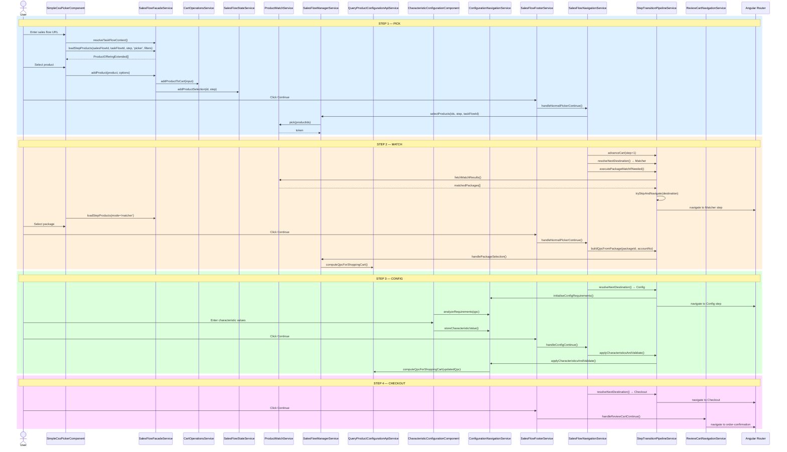
## 1.3 — User Interaction
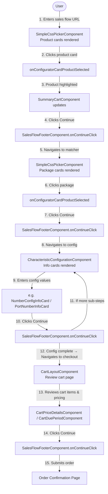
## 1.4 — Function Calls
```mermaid
flowchart TD
subgraph "PICK Phase"
A[SimpleCssPickerComponent.ngOnInit] --> B[loadTaskFlowContext]
B --> C[SalesFlowFacadeService.resolveTaskFlowContext]
C --> D[SalesConfigurationService.getTaskFlowFilters]
A --> E[loadItemsFromTaskFlow]
E --> F[SalesFlowFacadeService.loadStepProducts]
F --> G[ProductsAndServicesService.getProducts]
F --> H[SalesFlowStateService.setStepItems]
I[onConfiguratorCardProductSelected] --> J[ProductSelectionStateService.selectItem]
J --> K[SalesFlowFacadeService.addProduct]
K --> L[CartOperationsService.addProductToCart]
K --> M[SalesFlowStateService.addProductSelection]
end
subgraph "Continue → MATCH Phase"
N[SalesFlowFooterService.onContinueButtonClick] --> O[handleContinueButtonEvent]
O --> P[SalesFlowNavigationService.handleNormalPickerContinue]
P --> Q[SalesFlowManagerService.selectProducts → ProductMatchService.pick]
P --> R[StepTransitionPipelineService.advanceCart]
P --> S[StepTransitionPipelineService.resolveNextDestination]
P --> T[StepTransitionPipelineService.executePackageMatchIfNeeded]
T --> U[ProductMatchService.fetchMatchResults]
P --> V[StepTransitionPipelineService.trySkipAndNavigate]
end
subgraph "CONFIG Phase"
W[CharacteristicConfigurationComponent.constructor effect] --> X[ConfigurationFacadeService.analyzeRequirements]
X --> Y[QpcConfigurationAnalyzerService.analyzeConfigurationRequirements]
Z[FooterService.handleConfigurationContinue] --> AA[SalesFlowNavigationService.handleConfigContinue]
AA --> AB[StepTransitionPipelineService.applyCharacteristicsAndValidate]
AB --> AC[ConfigurationNavigationService.applyCharacteristicsAndValidate]
AC --> AD[QpcApiService.computeQpcForShoppingCart]
end
subgraph "CHECKOUT Phase"
AE[FooterService → isCartCreationMode] --> AF[ReviewCartNavigationService.handleReviewCartContinue]
AF --> AG[PickedProductsBuilderServiceExtended.validateAndSubmitCart]
AG --> AH[Router.navigate → order-confirmation]
end
```
## 1.5 — Reactivity
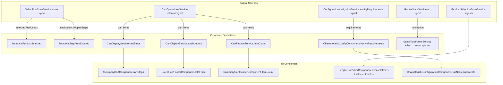
---
# ═══════════════════════════════════════════════
# FLOW 2: Pick Breakdown — Product Match Token Logic
# ═══════════════════════════════════════════════
## 2.1 — Data Flow
```mermaid
flowchart TD
A[User selects product in SimpleCssPickerComponent] -->|productId| B[ProductSelectionStateService.selectItem]
B -->|product| C[SalesFlowFacadeService.addProduct]
C -->|CartOperationResult| D[CartOperationsService.addProductToCart]
C -->|productId, stepNumber| E[SalesFlowStateService.addProductSelection]
C -->|stepNumber, productId| F[SalesFlowStateService.saveStepSelection]
G[User clicks Continue] --> H[SalesFlowFooterService.onContinueButtonClick]
H --> I[SalesFlowNavigationService.handleNormalPickerContinue]
I -->|productIds from state| J[SalesFlowStateService.state.selectedProductIds
filtered by stepNumber]
J -->|filtered productIds| K[SalesFlowManagerService.selectProducts
productIds, stepNumber, taskFlowId]
K -->|POST /pick API| L[ProductMatchService.pick
productIds, taskFlowId]
L -->|response contains token| M[ProductMatchService stores per-step token
Map: taskFlowId → token]
M -->|token persisted| N[StepTransitionPipelineService.resolveNextDestination]
N -->|next is Matcher?| O{Is next step Matcher?}
O -->|Yes| P[StepTransitionPipelineService.executePackageMatchIfNeeded]
P -->|GET /matchResults
interceptor attaches latest token| Q[ProductMatchService.fetchMatchResults]
Q -->|matched ProductOfferingExtended[]| R[Navigate to Matcher step]
O -->|No| S[Navigate to next Picker/Config/Checkout]
```
## 2.2 — Sequence
```mermaid
sequenceDiagram
actor User
participant Picker as SimpleCssPickerComponent
participant SelState as ProductSelectionStateService
participant Facade as SalesFlowFacadeService
participant CartOps as CartOperationsService
participant State as SalesFlowStateService
participant Footer as SalesFlowFooterService
participant NavSvc as SalesFlowNavigationService
participant Manager as SalesFlowManagerService
participant PMSvc as ProductMatchService
participant Pipeline as StepTransitionPipelineService
participant Interceptor as HTTP Interceptor
User->>Picker: Click product card
Picker->>SelState: selectItem(product)
SelState->>Facade: addProduct(product, {stepNumber, taskFlowId})
Facade->>CartOps: addProductToCart(input)
Facade->>State: addProductSelection(productId, stepNumber)
Facade->>State: saveStepSelection(step, id, isPackage, taskFlowId)
User->>Footer: Click Continue
Footer->>NavSvc: handleNormalPickerContinue(isConfigValid)
NavSvc->>NavSvc: #validateAndProcessSelections()
NavSvc->>NavSvc: #pickProductsForCurrentStep()
Note over NavSvc: Reads state.selectedProductIds filtered by currentStep
NavSvc->>Manager: selectProducts(productIds, step, taskFlowId)
Manager->>PMSvc: pick(productIds, taskFlowId)
Note over PMSvc: POST /productMatch/pick
Response includes per-step token
PMSvc->>PMSvc: storeToken(taskFlowId, token)
PMSvc-->>Manager: success=true
NavSvc->>Pipeline: advanceCart(step+1)
NavSvc->>Pipeline: resolveNextDestination(salesFlowId, taskFlowId, accountNo)
Pipeline-->>NavSvc: TransitionDestination{type,taskFlowId,taskFlowType,route}
alt Next step is Matcher
NavSvc->>Pipeline: executePackageMatchIfNeeded(salesFlowId)
Pipeline->>PMSvc: fetchMatchResults()
Note over Interceptor: Interceptor reads latest token
attaches to Authorization header
PMSvc-->>Pipeline: matchedPackages[]
end
NavSvc->>Pipeline: trySkipAndNavigate(destination, salesFlowId, accountNo)
Pipeline->>State: setTokenContextOverride(taskFlowId)
Note over Pipeline: Evaluates pre-nav skip for destination
Pipeline-->>NavSvc: navigated
```
## 2.3 — User Interaction
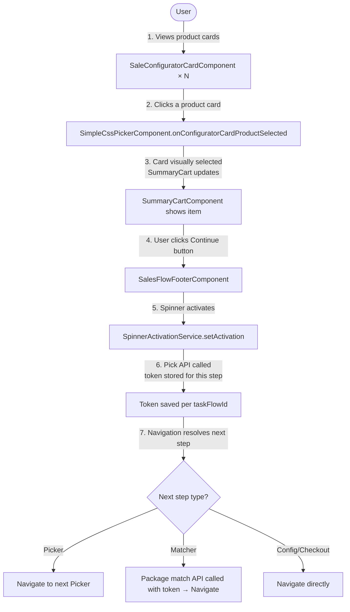
## 2.4 — Function Calls
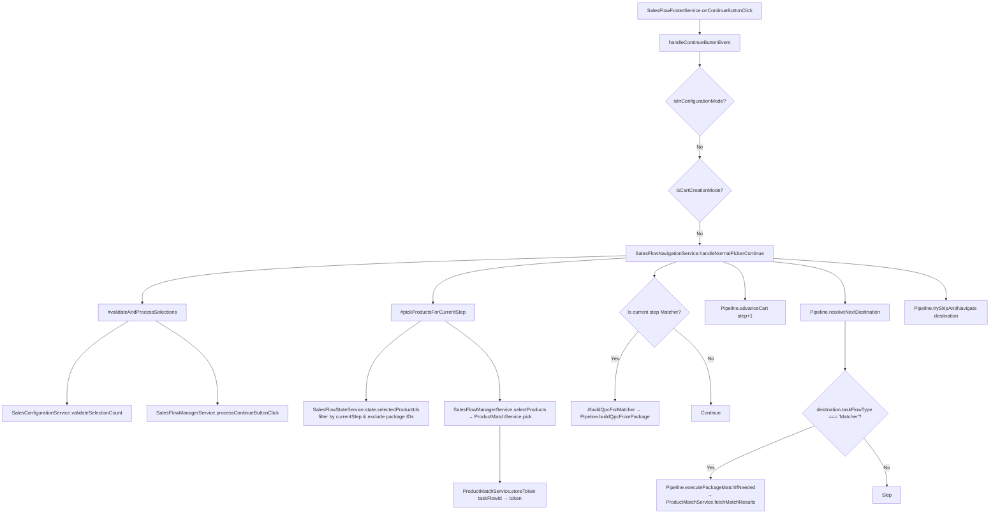
## 2.5 — Reactivity
```mermaid
flowchart TD
subgraph "Token Storage (Imperative)"
A[ProductMatchService.pick API call] -->|stores| B[internal Map: taskFlowId → token]
end
subgraph "Token Context Override (Signal)"
C[SalesFlowStateService.tokenContextOverride signal]
D[StepTransitionPipelineService.trySkipAndNavigate] -->|sets| C
C -->|read by| E[HTTP Interceptor resolves correct token]
end
subgraph "Product Selection Signals"
F[ProductSelectionStateService.selectedItemIds signal]
G[ProductSelectionStateService.availableItems signal]
F -->|drives| H[SimpleCssPickerComponent template SelectedItemIdsSet]
G -->|drives| I[SaleConfiguratorCardComponent rendering]
end
subgraph "State Propagation"
J[SalesFlowStateService.state.selectedProductIds]
J -->|read during continue| K[SalesFlowNavigationService.#pickProductsForCurrentStep
filters by stepNumber]
end
```
---
# ═══════════════════════════════════════════════
# FLOW 3: Pick with Auto Skip
# ═══════════════════════════════════════════════
## 3.1 — Data Flow
```mermaid
flowchart TD
A[SimpleCssPickerComponent.ngOnInit] --> B[SalesFlowFacadeService.loadStepProducts
deferStateUpdate: true]
B -->|items: ProductOfferingExtended[]| C{items.length === 1?}
C -->|Yes| D[SalesFlowFacadeService.evaluateAutoSkipForStep]
D --> E[SalesFlowAutoSkipService.checkAndExecuteAutoSkip]
E --> F[evaluatePickerSkip → shouldSkip:true, reason:'single-item']
F --> G[executePickerAutoSkip]
G --> G1[markStepAsAutoSkipped → State.addSkippedStep]
G --> G2[Manager.selectProducts → ProductMatchService.pick → token stored]
G --> G3[#addToCart → CartOperationsService.addProductToCart]
G --> G4[Pipeline.advanceCart step+1]
G --> G5[Pipeline.resolveNextDestination]
G --> G6[Pipeline.trySkipAndNavigate → may chain-skip next step]
C -->|No| H[SalesFlowFacadeService.finalizeStepProducts
show products, hide spinner]
```
## 3.2 — Sequence
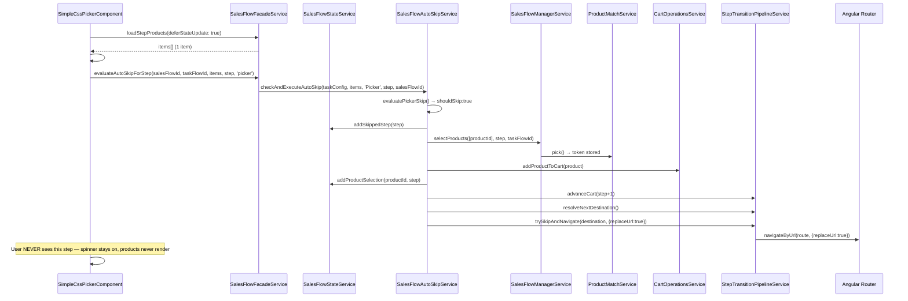
## 3.3 — User Interaction
```mermaid
flowchart TD
U([User]) -->|1. URL navigates to step| A[SimpleCssPickerComponent initializes]
A -->|2. Spinner shown| B[Loading spinner visible]
B -->|3. Products loaded — only 1 product| C{Auto-skip evaluates}
C -->|shouldSkip: true| D[Product auto-selected
Pick API called
Cart updated
INVISIBLY]
D -->|4. Immediate navigation
replaceUrl: true| E[Next step loads]
E -->|5. User sees next step directly| F[User never saw the skipped step]
Note over B,D: User only sees spinner briefly → next step appears
```
## 3.4 — Function Calls
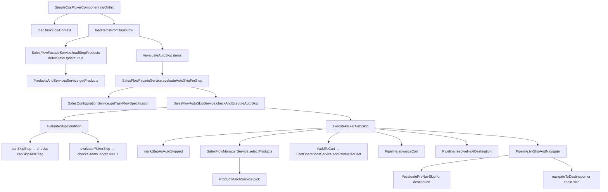
## 3.5 — Reactivity
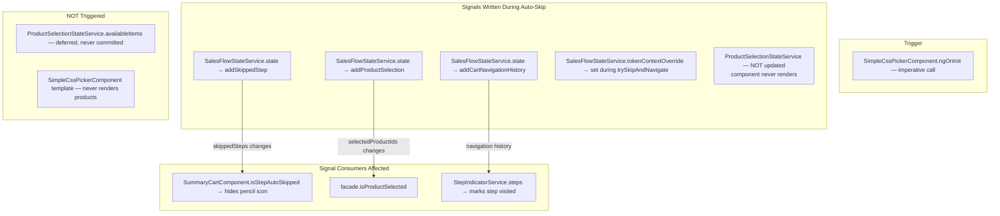
---
# ═══════════════════════════════════════════════
# FLOW 4: Pick without Auto Skip
# ═══════════════════════════════════════════════
## 4.1 — Data Flow
```mermaid
flowchart TD
A[SimpleCssPickerComponent.ngOnInit] --> B[SalesFlowFacadeService.loadStepProducts
deferStateUpdate: true]
B -->|items: ProductOfferingExtended[] — multiple items| C[#evaluateAutoSkip → wasSkipped=false]
C --> D[SalesFlowFacadeService.finalizeStepProducts]
D --> E[SalesFlowStateService.setStepItems → products visible in UI]
D --> F[SalesFlowStateService.setStepLoading false → spinner hides]
F --> G[ProductSelectionStateService.availableItems signal updates]
G --> H[SimpleCssPickerComponent template renders SaleConfiguratorCards]
H -->|User picks| I[ProductSelectionStateService.selectItem]
I --> J[SalesFlowFacadeService.addProduct]
J --> K[CartOperationsService.addProductToCart]
J --> L[SalesFlowStateService.addProductSelection]
```
## 4.2 — Sequence
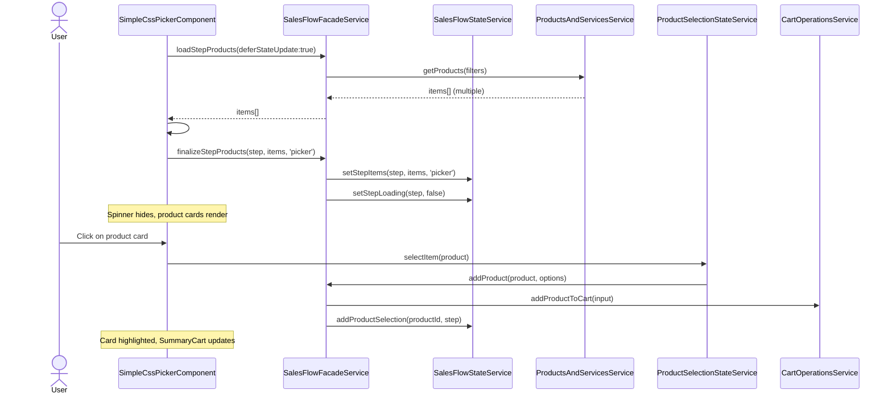
## 4.3 — User Interaction
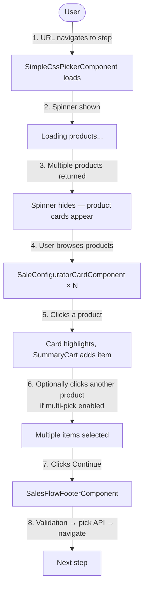
## 4.4 — Function Calls
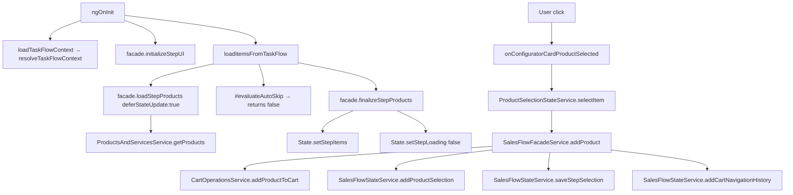
## 4.5 — Reactivity
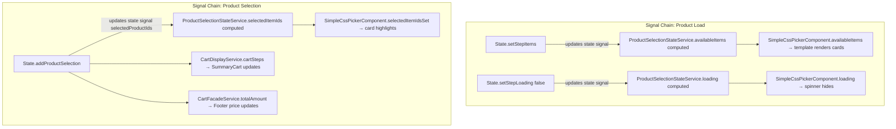
---
# ═══════════════════════════════════════════════
# FLOW 5: Pick until Package Match
# ═══════════════════════════════════════════════
## 5.1 — Data Flow
```mermaid
flowchart TD
subgraph "Picker Step 1"
A1[Load products] --> B1[User selects product A]
B1 --> C1[Pick API → token1 stored for taskFlow1]
end
subgraph "Picker Step 2 (if exists)"
C1 -->|Continue| D1[Load products for step 2]
D1 --> E1[User selects product B]
E1 --> F1[Pick API → token2 stored for taskFlow2]
end
subgraph "Transition to Matcher"
F1 -->|Continue → resolveNextDestination = Matcher| G1[Pipeline.executePackageMatchIfNeeded]
G1 --> H1[ProductMatchService.fetchMatchResults
interceptor attaches latest token from Map]
H1 -->|matched packages| I1[Navigate to Matcher step]
I1 --> J1[SimpleCssPickerComponent renders in matcher mode]
J1 -->|matched ProductOfferingExtended[]| K1[Package cards displayed]
end
```
## 5.2 — Sequence
```mermaid
sequenceDiagram
actor User
participant Picker as SimpleCssPickerComponent
participant NavSvc as SalesFlowNavigationService
participant Manager as SalesFlowManagerService
participant PMSvc as ProductMatchService
participant Pipeline as StepTransitionPipelineService
participant SalesConfig as SalesConfigurationService
participant Router as Angular Router
rect rgb(220,240,255)
Note over User,Router: Picker Step 1
User->>Picker: Select product A
User->>NavSvc: Continue clicked
NavSvc->>Manager: selectProducts([prodA.id], step1, taskFlow1)
Manager->>PMSvc: pick([prodA.id], taskFlow1)
PMSvc->>PMSvc: storeToken(taskFlow1, token1)
NavSvc->>Pipeline: resolveNextDestination(salesFlowId, taskFlow1, accountNo)
Pipeline->>SalesConfig: getNextTaskFlow() → taskFlow2 (Picker)
Pipeline-->>NavSvc: {type:'task-flow', taskFlowType:'Picker'}
NavSvc->>Pipeline: trySkipAndNavigate → navigate to Picker step 2
end
rect rgb(255,240,220)
Note over User,Router: Picker Step 2
User->>Picker: Select product B
User->>NavSvc: Continue clicked
NavSvc->>Manager: selectProducts([prodB.id], step2, taskFlow2)
Manager->>PMSvc: pick([prodB.id], taskFlow2)
PMSvc->>PMSvc: storeToken(taskFlow2, token2)
NavSvc->>Pipeline: resolveNextDestination() → taskFlow3 (Matcher)
Pipeline-->>NavSvc: {type:'task-flow', taskFlowType:'Matcher'}
NavSvc->>Pipeline: executePackageMatchIfNeeded(salesFlowId)
Pipeline->>PMSvc: fetchMatchResults() — interceptor uses latest token
PMSvc-->>Pipeline: matchedPackages[]
NavSvc->>Pipeline: trySkipAndNavigate → navigate to Matcher
Pipeline->>Router: navigate to Matcher URL
end
```
## 5.3 — User Interaction
```mermaid
flowchart TD
U([User]) -->|1. Step 1: Pick product| P1[Product A selected]
P1 -->|2. Continue| T1[Token1 stored → navigate]
T1 -->|3. Step 2: Pick product| P2[Product B selected]
P2 -->|4. Continue| T2[Token2 stored → package match API called]
T2 -->|5. Matched packages loaded| M[Matcher step:
Package cards displayed]
M -->|6. User selects package| M2[Package selected]
```
## 5.4 — Function Calls
```mermaid
flowchart TD
A[handleNormalPickerContinue Step1] --> B[#pickProductsForCurrentStep]
B --> C[Manager.selectProducts → PMSvc.pick → token1]
A --> D[Pipeline.advanceCart step+1]
A --> E[Pipeline.resolveNextDestination → Picker step2]
A --> F[Pipeline.trySkipAndNavigate → navigate to step2]
G[handleNormalPickerContinue Step2] --> H[#pickProductsForCurrentStep]
H --> I[Manager.selectProducts → PMSvc.pick → token2]
G --> J[Pipeline.advanceCart step+1]
G --> K[Pipeline.resolveNextDestination → Matcher]
K -->|taskFlowType=Matcher| L[Pipeline.executePackageMatchIfNeeded]
L --> M[ProductMatchService.fetchMatchResults]
G --> N[Pipeline.trySkipAndNavigate → navigate to Matcher]
```
## 5.5 — Reactivity
```mermaid
flowchart TD
subgraph "Token Management (Imperative — NOT signal-based)"
A[PMSvc.pick step1] -->|stores| B[tokenMap: taskFlow1→token1]
C[PMSvc.pick step2] -->|stores| D[tokenMap: taskFlow2→token2]
E[PMSvc.fetchMatchResults] -->|reads latest token from Map| F[HTTP request with token header]
end
subgraph "State Signals Across Steps"
G[State.selectedProductIds] -->|step1 entry| H[step1: prodA]
G -->|step2 entry| I[step2: prodB]
G -->|consumed by| J[SummaryCartComponent shows both items]
end
subgraph "Navigation Signal"
K[State.addCartNavigationHistory step+1] -->|navigation signal| L[StepIndicatorService.steps updates step indicators]
end
```
---
# ═══════════════════════════════════════════════
# FLOW 6: Pick → Match + Config
# ═══════════════════════════════════════════════
## 6.1 — Data Flow
```mermaid
flowchart TD
subgraph "PICK"
A[Products loaded] --> B[User selects]
B --> C[Pick API → token]
end
subgraph "MATCH"
C -->|Continue| D[Package match API with token]
D --> E[User selects package]
E --> F[QPC created from package
SalesFlowManagerService.handlePackageSelection]
F --> G[QueryProductConfigurationApiService.computeQpcForShoppingCart]
end
subgraph "CONFIG"
G -->|QPC| H[ConfigurationNavigationService.initialiseConfigRequirements]
H --> I[QpcConfigurationAnalyzerService.analyzeConfigurationRequirements]
I -->|QpcConfigurationRequirement[]| J[CharacteristicConfigurationComponent]
J -->|info card loads| K[e.g. NumberConfigInfoCard / SimConfigInfoCard]
K -->|user enters value| L[ConfigurationNavigationService.storeCharacteristicValue]
L -->|Continue| M[ConfigNav.applyCharacteristicsAndValidate]
M --> N[QpcApiService.computeQpcForShoppingCart updated QPC]
N -->|sub-steps?| O{More config sub-steps?}
O -->|Yes| J
O -->|No| P[NavigationCoordinatorService.navigateToNext → next step]
end
```
## 6.2 — Sequence
```mermaid
sequenceDiagram
actor User
participant Picker as SimpleCssPickerComponent
participant Footer as SalesFlowFooterService
participant NavSvc as SalesFlowNavigationService
participant Pipeline as StepTransitionPipelineService
participant PMSvc as ProductMatchService
participant Manager as SalesFlowManagerService
participant QPC as QueryProductConfigurationApiService
participant ConfigNav as ConfigurationNavigationService
participant QpcAnalyzer as QpcConfigurationAnalyzerService
participant CharConfig as CharacteristicConfigurationComponent
participant NavCoord as NavigationCoordinatorService
rect rgb(220,240,255)
Note over User,NavCoord: PICK
User->>Picker: Select product
User->>Footer: Continue
Footer->>NavSvc: handleNormalPickerContinue()
NavSvc->>Manager: selectProducts() → token stored
NavSvc->>Pipeline: resolveNextDestination() → Matcher
NavSvc->>Pipeline: executePackageMatchIfNeeded()
NavSvc->>Pipeline: trySkipAndNavigate → navigate to Matcher
end
rect rgb(255,240,220)
Note over User,NavCoord: MATCH
User->>Picker: Select package
User->>Footer: Continue
Footer->>NavSvc: handleNormalPickerContinue()
NavSvc->>Pipeline: buildQpcFromPackage(packageId, accountNo)
Pipeline->>Manager: handlePackageSelection()
Manager->>QPC: computeQpcForShoppingCart()
QPC-->>Manager: QPC with computed items
NavSvc->>Pipeline: resolveNextDestination() → Config
Pipeline->>ConfigNav: initialiseConfigRequirements(salesFlowId)
ConfigNav->>QpcAnalyzer: analyzeConfigurationRequirements(qpc, salesFlowId)
NavSvc->>Pipeline: trySkipAndNavigate → navigate to Config
end
rect rgb(220,255,220)
Note over User,NavCoord: CONFIG
CharConfig->>CharConfig: constructor effect() — reads workingQpc signal
CharConfig->>QpcAnalyzer: analyzeRequirements(qpc)
QpcAnalyzer-->>CharConfig: requirements[]
loop Each sub-step
User->>CharConfig: Enter characteristic value
CharConfig->>ConfigNav: storeCharacteristicValue(productId, name, value)
User->>Footer: Continue
Footer->>NavSvc: handleConfigContinue()
NavSvc->>Pipeline: applyCharacteristicsAndValidate()
Pipeline->>ConfigNav: applyCharacteristicsAndValidate()
ConfigNav->>QPC: computeQpcForShoppingCart(updatedQpc)
NavSvc->>Pipeline: navigateToNext()
Pipeline->>NavCoord: navigateToNext()
end
end
```
## 6.3 — User Interaction
```mermaid
flowchart TD
U([User]) -->|1. Pick product → Continue| A[Picker step]
A -->|2. Packages matched → displayed| B[Matcher step]
B -->|3. Select package → Continue| C[QPC created]
C -->|4. Config requirements analyzed| D[Config step — sub-step 1
e.g. Number selection]
D -->|5. Enter value → Continue| E{More sub-steps?}
E -->|Yes| F[Config step — sub-step 2
e.g. SIM configuration]
F -->|6. Enter value → Continue| E
E -->|No| G[Next step in flow]
```
## 6.4 — Function Calls
```mermaid
flowchart TD
subgraph "Pick → Match transition"
A[handleNormalPickerContinue] --> B[selectProducts → pick API]
A --> C[Pipeline.resolveNextDestination → Matcher]
A --> D[Pipeline.executePackageMatchIfNeeded]
A --> E[Pipeline.trySkipAndNavigate]
end
subgraph "Match → Config transition"
F[handleNormalPickerContinue on Matcher] --> G[#buildQpcForMatcher]
G --> H[Pipeline.buildQpcFromPackage]
H --> I[Manager.handlePackageSelection]
I --> J[QpcApiService.computeQpcForShoppingCart]
F --> K[Pipeline.resolveNextDestination → Config]
K --> L[Pipeline.navigateToNextTaskFlow]
L --> M[ConfigNav.initialiseConfigRequirements]
L --> N[NavigationCoordinator.navigate with queryParams]
end
subgraph "Config sub-step processing"
O[FooterService.handleConfigurationContinue] --> P[NavSvc.handleConfigContinue]
P --> Q[Pipeline.applyCharacteristicsAndValidate]
Q --> R[ConfigNav.applyCharacteristicsAndValidate]
R --> S[QpcApiService.computeQpcForShoppingCart]
P --> T[Pipeline.navigateToNext]
T --> U[NavCoord.navigateToNext]
end
```
## 6.5 — Reactivity
```mermaid
flowchart TD
subgraph "QPC Signal Chain"
A[QpcApiService stores QPC] -->|signal| B[ConfigurationFacadeService.workingQpc]
B -->|signal read by| C[CharacteristicConfigComponent constructor effect]
C -->|triggers| D[QpcConfigAnalyzer.analyzeConfigRequirements]
D -->|sets| E[configRequirementsSignal]
E -->|drives| F[Template: info card selection]
end
subgraph "Config Navigation Signals"
G[ConfigNav.currentConfigIndex signal]
H[ConfigNav.hasNextConfigStep computed]
I[ConfigNav.currentConfigRequirement computed]
G --> H
G --> I
I -->|drives| J[CharacteristicConfigComponent.currentRequirement]
end
subgraph "Validation Signal"
K[ConfigNav.isProcessing signal] -->|drives| L[Footer button disabled state]
M[ConfigFacade.setConfigValidity] -->|drives| N[SalesFlowValidationService.isConfigValid]
end
```
---
# ═══════════════════════════════════════════════
# FLOW 7: Pick → Match → Config with Token
# ═══════════════════════════════════════════════
## 7.1 — Data Flow
```mermaid
flowchart TD
A[Picker: User selects product] --> B[Pick API POST /productMatch/pick
body: productIds, taskFlowId]
B -->|response: token for this step| C[ProductMatchService.storeToken
Map: taskFlowId → token]
C -->|Continue → next is Matcher| D[ProductMatchService.fetchMatchResults
GET /productMatch/matchResults]
D -->|Interceptor reads latest token
attaches Authorization header| E[Backend resolves match using cumulative tokens]
E -->|matched packages| F[User selects package]
F -->|Continue| G[Pipeline.buildQpcFromPackage packageId accountNo]
G -->|Manager.handlePackageSelection| H[QpcApiService creates QPC from package]
H -->|QPC with products| I[ConfigNav.initialiseConfigRequirements]
I -->|QPC analyzed| J[Requirements → Config step navigated to]
J --> K[User configures characteristics]
K -->|ConfigNav.applyCharacteristicsAndValidate| L[QpcApiService.computeQpcForShoppingCart
POST with request items + applied characteristics]
L -->|validated QPC| M[Next step]
```
## 7.2 — Sequence
```mermaid
sequenceDiagram
participant Picker as SimpleCssPickerComponent
participant PMSvc as ProductMatchService
participant Interceptor as HTTP Token Interceptor
participant Backend as Backend API
participant Pipeline as StepTransitionPipelineService
participant Manager as SalesFlowManagerService
participant QPC as QueryProductConfigurationApiService
participant ConfigNav as ConfigurationNavigationService
participant QpcAnalyzer as QpcConfigurationAnalyzerService
Note over Picker,QpcAnalyzer: Token lifecycle across Pick → Match → Config
Picker->>PMSvc: pick([productId], taskFlowId)
PMSvc->>Backend: POST /productMatch/pick {products, taskFlowId}
Backend-->>PMSvc: {success, token: "abc123"}
PMSvc->>PMSvc: tokenMap.set(taskFlowId, "abc123")
Pipeline->>PMSvc: fetchMatchResults()
PMSvc->>Interceptor: GET /productMatch/matchResults
Interceptor->>Interceptor: Read latest token from ProductMatchService
Interceptor->>Backend: GET /matchResults + Authorization: Bearer abc123
Backend-->>PMSvc: matchedPackages[]
Pipeline->>Manager: handlePackageSelection(packageId, accountNo)
Manager->>QPC: createQpcFromPackage(packageId)
QPC->>Backend: POST /queryProductConfiguration
Backend-->>QPC: QPC{computedProductConfigurationItem[]}
ConfigNav->>QpcAnalyzer: analyzeConfigurationRequirements(qpc, salesFlowId)
QpcAnalyzer-->>ConfigNav: QpcConfigurationRequirement[]
Note over ConfigNav: User enters config values
ConfigNav->>QPC: computeQpcForShoppingCart(qpcWithRequestItems)
QPC->>Backend: POST /queryProductConfiguration/compute
Backend-->>QPC: validated QPC
```
## 7.3 — User Interaction
```mermaid
flowchart TD
U([User]) -->|1. Select product| P[Picker step]
P -->|2. Continue — token generated| T1[Token stored per step]
T1 -->|3. Package match with token| M[Matcher step]
M -->|4. Select package → Continue| Q[QPC created from package]
Q -->|5. Config requirements resolved| C[Config step]
C -->|6. Enter characteristics → Continue| V[QPC validated with characteristics]
V -->|7. Proceed| N[Next step]
```
## 7.4 — Function Calls
```mermaid
flowchart TD
A[NavSvc.handleNormalPickerContinue] --> B[#pickProductsForCurrentStep]
B --> C[Manager.selectProducts productIds step taskFlowId]
C --> D[PMSvc.pick productIds taskFlowId]
D --> E[PMSvc.storeToken taskFlowId token]
A --> F[Pipeline.resolveNextDestination → Matcher]
A --> G[Pipeline.executePackageMatchIfNeeded]
G --> H[PMSvc.fetchMatchResults ← interceptor attaches token]
A --> I[Pipeline.trySkipAndNavigate → Matcher]
J[NavSvc.handleNormalPickerContinue on Matcher] --> K[#buildQpcForMatcher]
K --> L[Pipeline.buildQpcFromPackage packageId accountNo]
L --> M[Manager.handlePackageSelection]
M --> N[QpcApiService.computeQpcForShoppingCart]
J --> O[Pipeline.resolveNextDestination → Config]
O --> P[Pipeline.navigateToNextTaskFlow]
P --> Q[ConfigNav.initialiseConfigRequirements salesFlowId]
Q --> R[QpcAnalyzer.analyzeConfigurationRequirements]
S[FooterService.handleConfigContinue] --> T[NavSvc.handleConfigContinue]
T --> U[Pipeline.applyCharacteristicsAndValidate]
U --> V[ConfigNav.applyCharacteristicsAndValidate]
V --> W[QpcApiService.computeQpcForShoppingCart updatedQpc]
```
## 7.5 — Reactivity
```mermaid
flowchart TD
subgraph "Token Flow (Imperative — NOT reactive)"
A[PMSvc.pick] -->|imperative store| B[internal Map taskFlowId→token]
B -->|imperative read by interceptor| C[HTTP request header]
end
subgraph "Token Context Override (Signal)"
D[State.tokenContextOverride signal]
E[Pipeline.trySkipAndNavigate sets override] --> D
D -->|consumed by| F[Interceptor resolves which token to use]
G[Pipeline completes → sets null] --> D
end
subgraph "QPC Signal Chain"
H[QpcApiService.computeQpcForShoppingCart] -->|stores QPC| I[workingQpc signal]
I -->|CharacteristicConfigComponent effect reads| J[analyzeRequirements triggered]
end
```
---
# ═══════════════════════════════════════════════
# FLOW 8: Pick → Match → Config → Checkout (Full Detail)
# ═══════════════════════════════════════════════
## 8.1 — Data Flow
```mermaid
flowchart TD
subgraph "PICK"
A[ProductsAndServicesService.getProducts] -->|products| B[User selects]
B -->|productId| C[CartOps.addProductToCart]
C --> D[State.addProductSelection]
B -->|Continue| E[Manager.selectProducts → PMSvc.pick → token]
end
subgraph "MATCH"
E --> F[PMSvc.fetchMatchResults with token]
F -->|packages| G[User selects package]
G -->|Continue| H[Pipeline.buildQpcFromPackage]
H --> I[QpcApiService → QPC created]
end
subgraph "CONFIG"
I --> J[QpcAnalyzer → requirements]
J --> K[User enters characteristics]
K --> L[ConfigNav.applyCharacteristicsAndValidate]
L --> M[QpcApiService.computeQpcForShoppingCart → validated QPC]
end
subgraph "CHECKOUT"
M -->|all config done| N[Pipeline.resolveNextDestination → Checkout]
N --> O[NavCoord.navigateToCheckoutStep]
O --> P[PickedProductsBuilderExtended.buildCartFromQpc]
P -->|ShoppingCart created from QPC| Q[CartLayoutComponent renders review]
Q -->|User clicks Continue| R[ReviewCartNav.handleReviewCartContinue]
R --> S[PickedProductsBuilderExtended.validateAndSubmitCart]
S -->|success| T[Router → order-confirmation]
S -->|requiresPayment| U[Router → payment page]
end
```
## 8.2 — Sequence
```mermaid
sequenceDiagram
actor User
participant Footer as SalesFlowFooterService
participant NavSvc as SalesFlowNavigationService
participant Pipeline as StepTransitionPipelineService
participant NavCoord as NavigationCoordinatorService
participant ReviewNav as ReviewCartNavigationService
participant Builder as PickedProductsBuilderExtended
participant Router as Angular Router
Note over User,Router: After Pick + Match + Config complete...
Footer->>NavSvc: handleConfigContinue() — last config sub-step
NavSvc->>Pipeline: applyCharacteristicsAndValidate() → true
NavSvc->>Pipeline: navigateToNext()
Pipeline->>NavCoord: navigateToNext()
Note over NavCoord: No more config sub-steps → resolve next task flow
NavCoord->>Pipeline: resolveNextDestination() → Checkout
Pipeline-->>NavCoord: {type:'checkout', taskFlowId, route}
NavCoord->>NavCoord: navigateToCheckoutStep()
NavCoord->>Builder: buildCartFromQpc()
Builder-->>NavCoord: ShoppingCart object
NavCoord->>Router: navigate to checkout URL
Note over User: CartLayoutComponent renders with review cart data
User->>Footer: Click Continue
Footer->>Footer: isCartCreationMode() → true
Footer->>ReviewNav: handleReviewCartContinue()
ReviewNav->>Builder: validateAndSubmitCart(cart)
alt Success
Builder-->>ReviewNav: {success: true}
ReviewNav->>Router: navigate to order-confirmation
else Payment Required
Builder-->>ReviewNav: {requiresPayment: true}
ReviewNav->>Router: navigate to payment page
end
```
## 8.3 — User Interaction
```mermaid
flowchart TD
U([User]) -->|1. PICK: Select product → Continue| S1[Step 1]
S1 -->|2. MATCH: Select package → Continue| S2[Step 2]
S2 -->|3. CONFIG: Enter values per sub-step → Continue each| S3[Step 3]
S3 -->|4. CHECKOUT: Review cart displayed| S4[CartLayoutComponent]
S4 -->|5. See line items + pricing| R1[CartPriceDetailsComponent
CartDuePeriodComponent
SavingsPromotionsComponent]
R1 -->|6. Review documents| R2[DocumentsSectionComponent]
R2 -->|7. Click Continue| R3{Payment required?}
R3 -->|No| R4[Order confirmation page]
R3 -->|Yes| R5[Payment page → then order confirmation]
```
## 8.4 — Function Calls
```mermaid
flowchart TD
subgraph "Checkout Navigation"
A[Pipeline.resolveNextDestination] --> B{getNextTaskFlow returns null?}
B -->|Yes| C[SalesConfig.findTaskFlowByType 'Checkout']
B -->|No and type=Checkout| D[Return checkout destination]
C --> D
D --> E[NavCoord.navigateToCheckoutStep]
E --> F[PickedProductsBuilderExtended.buildCartFromQpc]
E --> G[Router.navigate to checkout URL]
end
subgraph "Checkout Continue"
H[FooterService.onContinueButtonClick] --> I[isCartCreationMode → true]
I --> J[handleReviewCartContinue]
J --> K[ReviewCartNav.handleReviewCartContinue]
K --> L[LocalSalesServiceUtil.getLocalSalesData → cart]
K --> M[PickedProductsBuilderExtended.validateAndSubmitCart cart]
M --> N{result.success?}
N -->|Yes| O[Router.navigate order-confirmation]
N -->|No + requiresPayment| P[#handlePaymentRequired]
P --> Q[Router.navigateByUrl payment/mode/upfrontSales]
end
```
## 8.5 — Reactivity
```mermaid
flowchart TD
subgraph "Checkout Page Signals"
A[CartFacadeService.cartSteps] --> B[SummaryCartComponent]
C[CartFacadeService.totalAmount] --> D[SalesFlowFooterComponent.footerState]
E[CartFacadeService.currency] --> D
F[SalesFlowValidationService.isCheckoutButtonEnabled] --> D
end
subgraph "CartLayout Signals"
G[CartPricingCalculatorService.periodicSummary signal] --> H[CartPriceDetailsComponent]
G --> I[CartDuePeriodComponent]
J[CartPricingCalculatorService.savingsPromotions signal] --> K[SavingsPromotionsComponent]
end
subgraph "Footer Mode Detection"
L[SalesFlowFacadeService.getCurrentTaskFlowType] -->|returns 'Checkout'| M[FooterService.isCartCreationMode = true]
M -->|routes to| N[handleReviewCartContinue instead of handleNormalPickerContinue]
end
```
---
# ═══════════════════════════════════════════════
# FLOW 9: Whole Flow WITH Skip (All Steps Skippable)
# ═══════════════════════════════════════════════
## 9.1 — Data Flow
```mermaid
flowchart TD
A[Enter sales flow Step 1 Picker] -->|load 1 product| B[Auto-skip: select + pick API + cart]
B -->|Pipeline.trySkipAndNavigate| C{Step 2 Matcher}
C -->|evaluatePreNavSkip: load packages → 1 package| D[Auto-skip: select package + create QPC + cart]
D -->|Pipeline loop continues| E{Step 3 Config}
E -->|evaluatePreNavSkip: initialise config reqs → 0 requirements| F[Auto-skip: mark skipped]
F -->|Pipeline loop continues| G{Step 4 Checkout}
G -->|type = checkout → exit loop| H[Navigate to checkout]
H --> I[CartLayoutComponent renders — user sees review page directly]
```
## 9.2 — Sequence
```mermaid
sequenceDiagram
participant Picker as SimpleCssPickerComponent
participant AutoSkip as SalesFlowAutoSkipService
participant Pipeline as StepTransitionPipelineService
participant PMSvc as ProductMatchService
participant Manager as SalesFlowManagerService
participant QPC as QueryProductConfigurationApiService
participant ConfigNav as ConfigurationNavigationService
participant State as SalesFlowStateService
participant Router as Angular Router
Picker->>Picker: loadItemsFromTaskFlow → 1 product
Picker->>AutoSkip: checkAndExecuteAutoSkip(Picker, step1)
AutoSkip->>State: addSkippedStep(1)
AutoSkip->>Manager: selectProducts → token1
AutoSkip->>AutoSkip: #addToCart(product)
AutoSkip->>Pipeline: advanceCart(2)
AutoSkip->>Pipeline: trySkipAndNavigate(destination)
Note over Pipeline: SKIP LOOP iteration 1 — Step 2 Matcher
Pipeline->>Pipeline: #evaluatePreNavSkip(Matcher, step2)
Pipeline->>PMSvc: fetchMatchResults() → 1 package
Pipeline->>Pipeline: #executePreNavSkip(Matcher)
Pipeline->>State: addSkippedStep(2)
Pipeline->>Pipeline: #addToCart(package)
Pipeline->>Pipeline: buildQpcFromPackage(packageId) → QPC created
Pipeline->>Pipeline: advanceCart(3)
Note over Pipeline: SKIP LOOP iteration 2 — Step 3 Config
Pipeline->>Pipeline: #evaluatePreNavSkip(Config, step3)
Pipeline->>ConfigNav: initialiseConfigRequirements() → 0 requirements
Pipeline->>Pipeline: #executePreNavSkip(Config)
Pipeline->>State: addSkippedStep(3)
Pipeline->>Pipeline: advanceCart(4)
Note over Pipeline: SKIP LOOP iteration 3 — Step 4 Checkout
Pipeline->>Pipeline: destination.type === 'checkout' → EXIT LOOP
Pipeline->>Router: navigateToDestination(checkout)
Note over Picker: User lands directly on checkout — all previous steps were invisible
```
## 9.3 — User Interaction
```mermaid
flowchart TD
U([User]) -->|1. Enter sales flow URL| A[Spinner shows briefly]
A -->|2. Step 1 auto-skipped
Step 2 auto-skipped
Step 3 auto-skipped| B[All steps skipped in <2 seconds]
B -->|3. User lands directly on| C[Checkout / Review Cart page]
C -->|4. Reviews auto-selected items| D[Cart shows product + package]
D -->|5. Clicks Continue| E[Order submitted / Payment page]
Note over A,B: User never sees Pick, Match, or Config steps
```
## 9.4 — Function Calls
```mermaid
flowchart TD
A[SimpleCssPickerComponent.loadItemsFromTaskFlow] --> B[Facade.loadStepProducts → 1 item]
B --> C[#evaluateAutoSkip → true]
C --> D[AutoSkip.executePickerAutoSkip]
D --> D1[State.addSkippedStep 1]
D --> D2[Manager.selectProducts → token]
D --> D3[#addToCart product]
D --> D4[Pipeline.advanceCart 2]
D --> D5[Pipeline.resolveNextDestination → Matcher]
D --> D6[Pipeline.trySkipAndNavigate]
D6 --> E[Loop iter 1: #evaluatePreNavSkip Matcher step2]
E --> E1[PMSvc.fetchMatchResults → 1 package]
E --> E2[#executePreNavSkip Matcher]
E2 --> E3[State.addSkippedStep 2]
E2 --> E4[#addToCart package]
E2 --> E5[buildQpcFromPackage → QPC]
E2 --> E6[advanceCart 3]
E6 --> F[Loop iter 2: #evaluatePreNavSkip Config step3]
F --> F1[ConfigNav.initialiseConfigRequirements → 0 reqs]
F --> F2[#executePreNavSkip Config]
F2 --> F3[State.addSkippedStep 3]
F2 --> F4[advanceCart 4]
F4 --> G[Loop iter 3: destination.type=checkout → EXIT]
G --> H[navigateToDestination checkout]
```
## 9.5 — Reactivity
```mermaid
flowchart TD
subgraph "State Mutations During Skip Chain"
A[State.addSkippedStep 1] --> B[State.addSkippedStep 2] --> C[State.addSkippedStep 3]
D[State.addProductSelection step1] --> E[State.addProductSelection step2 package]
F[State.addCartNavigationHistory 2] --> G[...3] --> H[...4]
end
subgraph "Signals That Fire After Chain"
B --> I[SummaryCartComponent: steps 1-3 have pencil icon hidden]
E --> J[CartDisplayService.cartSteps: shows product + package]
J --> K[CartFacadeService.totalAmount: aggregated price]
K --> L[SalesFlowFooterComponent.footerState: shows total]
end
subgraph "Signals That Do NOT Fire"
M[ProductSelectionStateService.availableItems — deferred, never committed for skipped steps]
N[SimpleCssPickerComponent template — never renders]
end
```
---
# ═══════════════════════════════════════════════
# FLOW 10: Whole Flow WITHOUT Skip
# ═══════════════════════════════════════════════
## 10.1 — Data Flow
```mermaid
flowchart TD
subgraph "Step 1: Picker"
A[Load multiple products] --> B[User manually selects]
B --> C[Cart updated]
C --> D[Continue → pick API → token]
end
subgraph "Step 2: Matcher"
D --> E[Package match with token]
E --> F[Multiple packages shown]
F --> G[User manually selects package]
G --> H[Continue → QPC created]
end
subgraph "Step 3: Config"
H --> I[QPC analyzed → multiple requirements]
I --> J[Sub-step 1: User configures]
J --> K[Continue → apply + validate QPC]
K --> L{More sub-steps?}
L -->|Yes| M[Sub-step N: User configures]
M --> K
L -->|No| N[All config complete]
end
subgraph "Step 4: Checkout"
N --> O[Review cart page]
O --> P[User reviews → Continue]
P --> Q[Validate + submit cart]
Q --> R[Order confirmation / Payment]
end
```
## 10.2 — Sequence
```mermaid
sequenceDiagram
actor User
participant Picker as SimpleCssPickerComponent
participant Facade as SalesFlowFacadeService
participant Footer as SalesFlowFooterService
participant NavSvc as SalesFlowNavigationService
participant Pipeline as StepTransitionPipelineService
participant Manager as SalesFlowManagerService
participant PMSvc as ProductMatchService
participant QPC as QueryProductConfigurationApiService
participant ConfigNav as ConfigurationNavigationService
participant CharConfig as CharacteristicConfigurationComponent
participant ReviewNav as ReviewCartNavigationService
participant CartLayout as CartLayoutComponent
participant Router as Angular Router
rect rgb(220,240,255)
Note over User,Router: STEP 1 — Manual Picker
Picker->>Facade: loadStepProducts → multiple products
Picker->>Facade: evaluateAutoSkipForStep → false (multiple items)
Picker->>Facade: finalizeStepProducts → cards render
User->>Picker: Manually select product
User->>Footer: Continue
Footer->>NavSvc: handleNormalPickerContinue()
NavSvc->>Manager: selectProducts → token
NavSvc->>Pipeline: trySkipAndNavigate → Matcher (not skippable, multiple packages)
end
rect rgb(255,240,220)
Note over User,Router: STEP 2 — Manual Matcher
Picker->>Facade: loadStepProducts matcher → multiple packages
Picker->>Facade: evaluateAutoSkipForStep → false
User->>Picker: Manually select package
User->>Footer: Continue
NavSvc->>Pipeline: buildQpcFromPackage → QPC created
NavSvc->>Pipeline: trySkipAndNavigate → Config (not skippable, has requirements)
end
rect rgb(220,255,220)
Note over User,Router: STEP 3 — Manual Config
CharConfig->>ConfigNav: analyzeRequirements → 2 requirements
User->>CharConfig: Enter value for sub-step 1
User->>Footer: Continue
NavSvc->>Pipeline: applyCharacteristicsAndValidate → true
Pipeline->>Pipeline: navigateToNext → config sub-step 2
User->>CharConfig: Enter value for sub-step 2
User->>Footer: Continue
NavSvc->>Pipeline: applyCharacteristicsAndValidate → true
Pipeline->>Pipeline: navigateToNext → no more sub-steps → next task flow
end
rect rgb(255,220,255)
Note over User,Router: STEP 4 — Checkout
CartLayout->>CartLayout: Load priced cart from API
User->>Footer: Continue
Footer->>ReviewNav: handleReviewCartContinue()
ReviewNav->>Router: order-confirmation
end
```
## 10.3 — User Interaction
```mermaid
flowchart TD
U([User]) -->|1. Enter sales flow| P1[Step 1: See multiple products]
P1 -->|2. Browse and pick product| P2[Product selected + visible in SummaryCart]
P2 -->|3. Continue| M1[Step 2: See multiple packages]
M1 -->|4. Browse and pick package| M2[Package selected + visible in SummaryCart]
M2 -->|5. Continue| C1[Step 3 Sub-step 1: Config form]
C1 -->|6. Fill in characteristic| C2[Value entered]
C2 -->|7. Continue| C3{More config?}
C3 -->|Yes| C4[Step 3 Sub-step 2: Config form]
C4 -->|8. Fill in| C3
C3 -->|No| CH[Step 4: Review cart]
CH -->|9. Review line items + total| CH2[Price details visible]
CH2 -->|10. Continue| O[Order confirmed / Payment]
```
## 10.4 — Function Calls
```mermaid
flowchart TD
subgraph "Step 1"
A1[ngOnInit] --> A2[loadStepProducts → multiple items]
A2 --> A3[evaluateAutoSkipForStep → false]
A3 --> A4[finalizeStepProducts → render]
A5[onContinueButtonClick] --> A6[handleNormalPickerContinue]
A6 --> A7[#validateAndProcessSelections]
A6 --> A8[#pickProductsForCurrentStep → selectProducts → pick]
A6 --> A9[Pipeline.trySkipAndNavigate → navigate]
end
subgraph "Step 2"
B1[loadStepProducts matcher → multiple packages]
B2[evaluateAutoSkipForStep → false]
B3[finalizeStepProducts → render]
B4[handleNormalPickerContinue]
B4 --> B5[#buildQpcForMatcher → Pipeline.buildQpcFromPackage]
B4 --> B6[Pipeline.trySkipAndNavigate → config not skippable → navigate]
end
subgraph "Step 3"
C1[CharacteristicConfig effect → analyzeRequirements]
C2[handleConfigContinue sub-step 1]
C2 --> C3[applyCharacteristicsAndValidate]
C2 --> C4[navigateToNext → sub-step 2]
C5[handleConfigContinue sub-step 2]
C5 --> C6[applyCharacteristicsAndValidate]
C5 --> C7[navigateToNext → exit config → checkout]
end
subgraph "Step 4"
D1[isCartCreationMode → true]
D2[handleReviewCartContinue]
D2 --> D3[validateAndSubmitCart]
end
```
## 10.5 — Reactivity
```mermaid
flowchart TD
subgraph "Each Step Has Full Signal Lifecycle"
A[State.setStepItems] --> B[ProductSelectionStateService.availableItems]
B --> C[Template renders cards]
D[State.setStepLoading false] --> E[loading signal → spinner hides]
F[User selects → State.addProductSelection] --> G[selectedItemIds signal]
G --> H[Card highlights + SummaryCart updates]
end
subgraph "Cross-Step Signal Accumulation"
I[Step1 cart items] --> J[CartDisplayService.cartSteps]
K[Step2 cart items] --> J
J --> L[SummaryCartComponent — grows with each step]
J --> M[CartFacadeService.totalAmount — accumulates pricing]
end
subgraph "Config Reactive Chain"
N[QPC stored] --> O[workingQpc signal]
O --> P[CharacteristicConfigComponent effect]
P --> Q[analyzeRequirements → configRequirementsSignal]
Q --> R[Template renders info cards]
end
```
---
# ═══════════════════════════════════════════════
# FLOW 11: Configuration to Dashboard Generation
# ═══════════════════════════════════════════════
## 11.1 — Data Flow
```mermaid
flowchart TD
A[default-config.json
salesProcessFlowSpecification] -->|loaded at app init| B[SalesConfigurationService.setConfiguration]
B -->|raw config| C[SalesDashboardGeneratorService.generateDashboardsFromSalesProcessFlowConfig]
C --> D[handleIncludesTaskFlowFrom
resolve cross-flow task flow inheritance]
D --> E[For each enabled salesFlow]
E --> F[getAllTaskFlowsFromSalesFlow
extract flat taskFlowSpecification entries]
F --> G[For each enabled taskFlow]
G --> H[createDashboardForTaskFlow]
H --> H1[buildInAccountRoute:
'selfcare/ecomm/account/:AccountNo/salesflow/{salesFlowId}/{taskFlowId}']
H --> H2[mergeCards: taskFlow.cards + salesFlow.cards via deepmerge]
H --> H3[resolveParentFlowType:
lookup ParentFlowtypeConfigurationAndRelatedSubsteps]
H --> H4[Dashboard created:
name: 'salesFlowId__taskFlowId'
type: 'SALES_PROCESS_FLOW']
H4 --> I[cfg.config['@cerillion/css-components'].dashboards['name']]
I --> J[fw-navigation reads dashboards → routes registered → components loaded per route]
```
## 11.2 — Sequence
```mermaid
sequenceDiagram
participant App as App Init / WebConfigService
participant Generator as SalesDashboardGeneratorService
participant SalesConfig as SalesConfigurationService
participant CSSNav as ParentFlowtypeConfig
participant FWNav as fw-navigation Dashboard Loader
participant Router as Angular Router
App->>Generator: generateDashboardsFromSalesProcessFlowConfig(cfg, injector)
Generator->>SalesConfig: getConfiguration()
SalesConfig-->>Generator: rawSalesConfig.salesProcessFlowSpecification
Generator->>Generator: handleIncludesTaskFlowFrom(salesFlows)
Note over Generator: Resolve includesTaskFlowFrom cross-references
loop Each enabled salesFlow
Generator->>Generator: getAllTaskFlowsFromSalesFlow(salesFlow)
loop Each enabled taskFlow
Generator->>Generator: createDashboardForTaskFlow(cfg, salesFlow, taskFlow)
Generator->>Generator: mergeCards(taskFlow.cards, salesFlow.cards)
Generator->>Generator: resolveParentFlowType(taskFlow.type)
Generator->>CSSNav: lookup ParentFlowtypeConfigurationAndRelatedSubsteps
CSSNav-->>Generator: parentFlowType (e.g. 'Product_Selection', 'Config')
Generator->>Generator: Register dashboard: salesFlowId__taskFlowId
end
end
Generator-->>App: cfg with dashboards populated
App->>FWNav: Load dashboards from config
FWNav->>Router: Register routes for each dashboard
Note over Router: Each route maps to
/account/:AccountNo/salesflow/:salesFlowId/:taskFlowId
with cards defining which components to render
```
## 11.3 — User Interaction
```mermaid
flowchart TD
U([User/Admin]) -->|1. Edits default-config.json| A[salesProcessFlowSpecification section]
A -->|2. Defines sales flows with taskFlowSpecification entries| B[Each taskFlow has: type, cards, enabled, canSkipTask, etc.]
B -->|3. App starts / config reloads| C[SalesDashboardGeneratorService runs]
C -->|4. Dashboards auto-generated| D[Routes registered for each taskFlow]
D -->|5. User navigates to
/account/123/salesflow/flowA/step1| E[Dashboard loads with SimpleCssPickerComponent card]
E -->|6. fw-navigation resolves dashboard → renders cards| F[Components render in dashboard layout]
```
## 11.4 — Function Calls
```mermaid
flowchart TD
A[WebConfigService hook] --> B[SalesDashboardGeneratorService.generateDashboardsFromSalesProcessFlowConfig cfg injector]
B --> C[SalesConfigurationService.getConfiguration]
B --> D[handleIncludesTaskFlowFrom salesFlows]
D --> E[buildListOfProcessFlows]
D --> F{Has includesTaskFlowFrom?}
F -->|Yes| G[mergeTaskFlowSpecifications via deepmerge]
F -->|No| H[Pass through]
B --> I[initialiseDashboardAreas cfg]
B --> J[Loop: Object.keys processedSalesFlows]
J --> K{salesFlow.enabled?}
K -->|Yes| L[getAllTaskFlowsFromSalesFlow]
L --> M[Loop: taskFlows]
M --> N{taskFlow.enabled?}
N -->|Yes| O[createDashboardForTaskFlow]
O --> P[mergeCards taskFlow.cards salesFlow.cards]
O --> Q[resolveParentFlowType taskFlow.type]
Q --> R[Lookup ParentFlowtypeConfigurationAndRelatedSubsteps]
O --> S[Build route: selfcare/ecomm/account/:AccountNo/salesflow/salesFlowId/taskFlowId]
O --> T[Set dashboards dashboardName = routes + cards + type]
```
## 11.5 — Reactivity
```mermaid
flowchart TD
subgraph "Static Generation (No Signals — runs once at app init)"
A[default-config.json loaded] --> B[generateDashboardsFromSalesProcessFlowConfig]
B --> C[ConfigFile mutated: dashboards object populated]
C --> D[fw-navigation reads dashboards]
D --> E[Angular Router routes registered]
end
subgraph "Runtime Queries (Imperative — NOT reactive)"
F[SalesDashboardGeneratorService.getSalesFlowDashboards salesFlowId]
G[SalesDashboardGeneratorService.getDashboardById dashboardId]
H[SalesDashboardGeneratorService.getFirstDashboardRoute salesFlowId accountNo]
I[SalesDashboardGeneratorService.getDashboardGenerationStats]
end
subgraph "Connection to Sales Flow"
E -->|User navigates to route| J[Dashboard widget loads]
J -->|widgetData.additionalInfo has salesFlowId + taskFlowId| K[SimpleCssPickerComponent.ngOnInit]
K -->|resolveTaskFlowContext reads from widgetData| L[Sales flow begins]
end
```
---
# Summary — 55 Diagrams Index
| # | Flow | Data Flow | Sequence | User Interaction | Function Calls | Reactivity |
|---|------|-----------|----------|------------------|----------------|------------|
| 1 | Pick→Match→Config→Checkout (high level) | 1.1 | 1.2 | 1.3 | 1.4 | 1.5 |
| 2 | Pick with product match token | 2.1 | 2.2 | 2.3 | 2.4 | 2.5 |
| 3 | Pick with auto skip | 3.1 | 3.2 | 3.3 | 3.4 | 3.5 |
| 4 | Pick without auto skip | 4.1 | 4.2 | 4.3 | 4.4 | 4.5 |
| 5 | Pick until package match | 5.1 | 5.2 | 5.3 | 5.4 | 5.5 |
| 6 | Pick + Match + Config | 6.1 | 6.2 | 6.3 | 6.4 | 6.5 |
| 7 | Pick + Match + Config with token | 7.1 | 7.2 | 7.3 | 7.4 | 7.5 |
| 8 | Pick + Match + Config + Checkout | 8.1 | 8.2 | 8.3 | 8.4 | 8.5 |
| 9 | Whole flow WITH skip | 9.1 | 9.2 | 9.3 | 9.4 | 9.5 |
| 10 | Whole flow WITHOUT skip | 10.1 | 10.2 | 10.3 | 10.4 | 10.5 |
| 11 | Configuration → Dashboard generation | 11.1 | 11.2 | 11.3 | 11.4 | 11.5 |
Chat